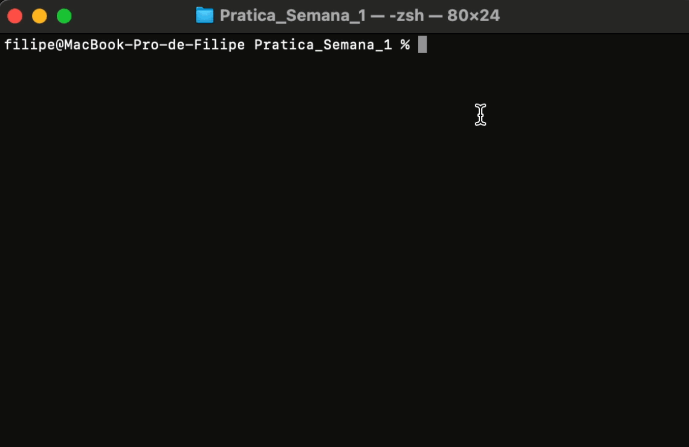

# Atividade prática da 1ª semana - 5 pontos 

Crie um programa em JavaScript que permita a coleta dos seguintes dados de uma pessoa por meio do terminal, a fim de criar um futuro cadastro fictício: **Nome completo, RG, CPF e Data de Nascimento**. Caso a pessoa tenha mais de 18 anos, o sistema deve solicitar também o **número do título de eleitor**.

Após a coleta dos dados, o sistema deve exibi-los na tela para confirmação. Se os dados estiverem corretos, o programa será encerrado. Caso haja algum dado a ser corrigido, o programa reiniciará.

Para verificar a idade da pessoa fictícia, **utilize os conhecimentos adquiridos no Módulo 3 do FIC 1**, que abordou a introdução à linguagem JavaScript. Crie um **arquivo separado** do arquivo principal (index.js) e, nesse arquivo, desenvolva uma função para realizar essa verificação. **Esse arquivo será o módulo que você deverá importar no arquivo principal para realizar a validação da idade.**

Exemplo do comportamento do sistema:

**Nota: 5 pontos**

**Prazo: 12/12/2023**

  